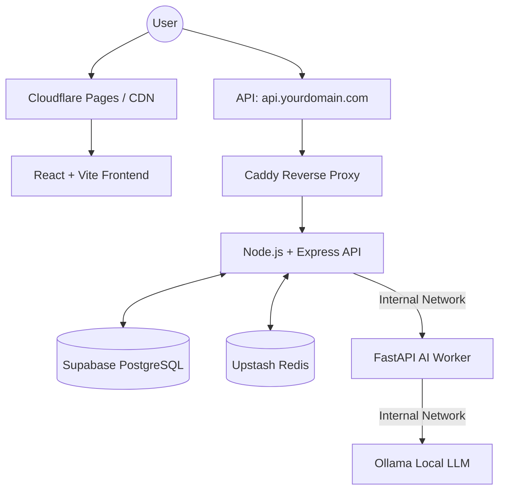

# Architecture Documentation

## Overview
The Story Writing App is designed as a dynamic AI-powered writing coach that evaluates stories from three distinct perspectives: English Teacher, Story Editor, and Director. The application uses a multi-layered architecture focused on performance, private AI processing, and real-time gamification.

## Final Architecture Stack

## Frontend Layer
- **Framework**: React 18, Vite.
- **Routing**: React Router DOM (SPA).
- **Deployment**: Cloudflare Pages.
- **State**: React Context (`AuthContext`), optimistic UI updates.
- **Key Responsibilities**: UI rendering, writing editor (ProseMirror), real-time timer tracking, data visualization (Recharts).

## Backend Layer (Node.js API)
- **Framework**: Express.js (TypeScript).
- **Deployment**: Docker container on GPU server.
- **Database ORM**: Prisma.
- **Key Responsibilities**: Authentication (JWT, bcrypt), Session Management, Gamification logic (XP, Streaks), Leaderboard serving, and Proxying AI tasks to FastAPI.

## Database (Source of Truth)
- **Engine**: Supabase PostgreSQL.
- **Key Responsibilities**: Reliable storage of users, writing sessions, versions, AI feedback (JSON), profile analytics, and XP events. 

## In-Memory Store
- **Engine**: Upstash Redis.
- **Key Responsibilities**:
  - Global and weekly Leaderboard ranking (`zrevrange`, `zrevrank`).
  - Rate limiting (especially for AI endpoints).
  - High-performance caching fallback.

## AI Layer
- **Engine**: FastAPI (Python) + Ollama + Local LLMs (Llama 3.1).
- **Key Responsibilities**: Running heavy generative AI prompts, JSON schema enforcement via Pydantic, parallel evaluation of stories.
- **Security**: The FastAPI and Ollama ports (8000, 11434) are completely blocked from external internet access. Only the Node.js API can communicate with FastAPI over the internal network.

## Gamification & Leaderboard Mechanism
1. **Action**: User completes a revision or high-value action.
2. **Database Update**: An `XPEvent` is safely logged in PostgreSQL (Source of truth).
3. **Cache Update**: Node.js increments the user's score in Upstash Redis using `ZINCRBY`.
4. **Display**: The Leaderboard UI fetches the ordered set `WITHSCORES` from Redis, achieving O(log(N)) fetch speeds.
5. **Recovery**: If Redis is wiped, the leaderboard is completely rebuilt by summing the `XPEvent` table in PostgreSQL.
